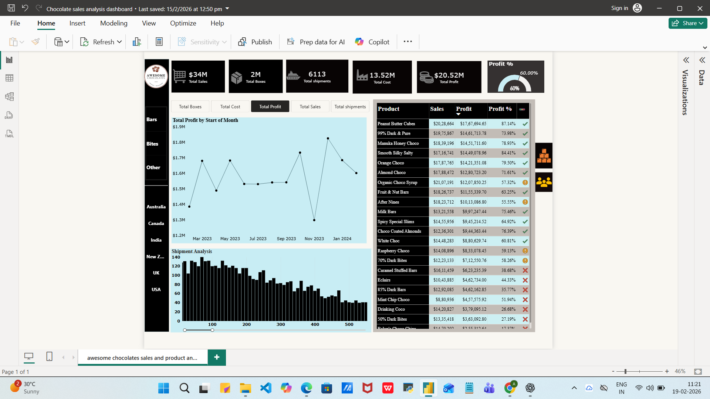

# 🍫 Chocolate Sales Analysis Dashboard (Power BI)

## 📌 Project Overview
This project presents an interactive Power BI dashboard analyzing chocolate sales data to uncover business insights related to revenue, cost, profit, and shipment performance.

The objective of this project is to practice data modeling, DAX calculations, and dashboard design by simulating real-world business analysis scenarios.

---

## 📊 Business KPIs
- Total Sales: $34M
- Total Cost: $13.52M
- Total Profit: $20.52M
- Profit Percentage: 60%
- Total Shipments: 6113

---

## 📈 Dashboard Insights
- Monthly profit trend analysis
- Shipment distribution overview
- Product-wise sales and profitability comparison
- KPI summary cards for quick business evaluation
- Interactive filtering for dynamic analysis

---

## 🛠 Tools & Technologies Used
- Power BI
- DAX (Data Analysis Expressions)
- Microsoft Excel
- Data Modeling

---

## 📂 Dataset Information
The dataset used in this project is an Excel-based chocolate sales dataset created for learning and practice purposes.

---

## 📷 Dashboard Preview

---

## 🎯 Learning Outcome
- Improved understanding of DAX measures and calculated columns
- Strengthened data visualization and storytelling skills
- Gained hands-on experience in KPI reporting
- Practiced building interactive business dashboards

---

## 📌 Note
This is a practice project created to enhance Power BI and data analytics skills.
